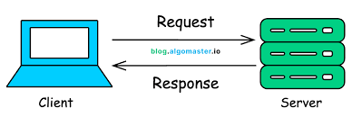

 # WEB TECHNOLOGY 
 Assignment 1

Date: Dec 20th 2025

Name:Samir Shrestha

Program: BIT 3rd I

Roll no:26   

        

   ## CHAPTER 1: AN OVERVIEW OF THE INTERNET AND THE WEB

*Group A: Short Questions (2 Marks)*

1. Define the term ”Protocol” in the context of the Internet?

 Ans: In the context of internet, a protocol is a standardized set of rules and regulations , that controls how devices   communication across diverse networks.Example: TCP and IP manage reliable data delivery and addressing.

2. *What is the primary difference between a Web Browser and a Search Engine?*

Ans:A web browser is the app you use to open the internet.

A search engine is a website that helps you find things on the internet.
 
3. *Define the World Wide Web (WWW)?*

Ans:The World Wide Web (WWW or Web) is a vast system of interconnected documents (webpages, videos, files) accessed via the Internet, using hyperlinks to jump between resources, making information easily navigable through web browsers like Chrome or Firefox

*4.Distinguish between a static web page and a dynamic web page?*

Ans: Static web page:
Shows the same content to everyone and does not change unless the developer updates it.
 Example: A basic information page.

Dynamic web page:
Content changes based on user actions or data (like login, time, or location).
 Example: Social media, online shopping sites.
 

Group B: Long Questions (4 Marks)

5. Explain the client-server architecture of the web with a neat diagram? 

Ans:The client–server architecture explains how the web works by dividing tasks between two sides:

Client: The user’s device (computer, phone) with a web browser

Server: A powerful computer that stores websites and data

How it works:

The client (browser) sends a request (e.g., open a webpage).

The server receives the request.

The server processes it and sends back the webpage.

The client displays the webpage to the user.

6.Describe the functions of the following Internet services: Email, FTP, and VoIP.

7."The Internet is a network of networks." Elaborate on this statement explaining how packet switching works. 

Ans

Group C: Scenario-Based Questions (5 Marks)

8. A startup company wants to host a website that displays the same information to all visitors and requires very low  maintenance costs. However, they are being advised to use a dynamic website. As a consultant, would you agree? Justify your answer.

 Ans:
     
9. A user types www.google.com into their browser, but the browser displays a ”Server Not Found” error, even though the internet connection is active. However, accessing the site via 142.250.190.46 works. Diagnose the problem and explain the underlying technology that failed.  

Ans:

10. A multinational corporation wants to share sensitive inventory data with specific suppliers but does not want this information available to the general public. Explain which network type (Intranet, Extranet, or Internet) they should implement and why.

Ans: